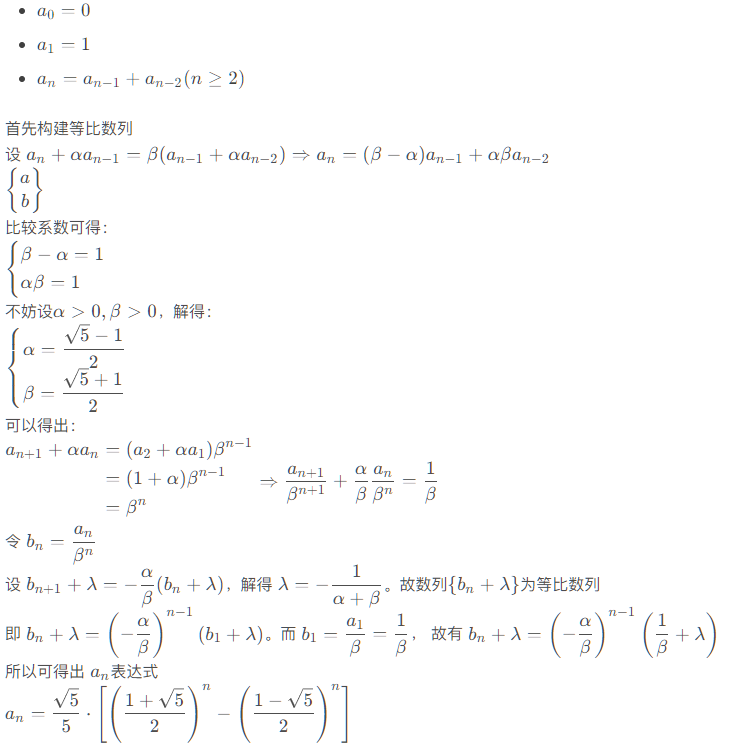

## 递归方式求解

```python
def fib_recursion(num: int) -> int:
    if num == 0:
        return 0
    if num == 1:
        return 1
    return fibonacci(num - 1) + fibonacci(num - 2)
```

## for 循环求解

```python
def fib_loop(num: int) -> int:
    if num == 0:
        return 0
    if num == 1:
        return 1
    pre_res = [0, 1]
    for i in range(num - 1):
        res = pre_res[0] + pre_res[1]
        pre_res[0] = pre_res[1]
        pre_res[1] = res

    return res
```

## 公式求解



```python
import math

def fib_equation(num: int) -> int:
    COE = math.sqrt(5)
    res = COE / 5 * (pow((1 + COE) / 2, num) - pow((1 - COE) / 2, num))
    return res
```

## 比较

```python
import time

num = 100
start = time.perf_counter()
# res = fib_recursion(num)
# res = fib_loop(num)
res = fib_equation(num)
total_time = time.perf_counter() - start
print(res, total_time)
```

### 结果

| num  |结果 |递归 | 循环 | 公式 |
| :--: | :-------------: | :---------------------: | :--------------------: | :--: |
|  5   | 5 | 3.85e-05 |8.7e-06| … |
|  10  | 55 | 0.0001164 |9.1e-06| … |
|  20  | 6765 | 0.019072699999999998 |1.67e-05| … |
|  50  | 12586269025 | ✘ |4.2e-05| … |
| 100  | 354224848179261915075 | ✘ |3.68e-05| … |
| 500  | fib(500) | ✘ |0.0007797| … |
| 1000 | fib(1000) | ✘ |✘| 3.26e-05 |

> fib(500) = 139423224561697880139724382870407283950070256587697307264108962948325571622863290691557658876222521294125
>
> fib(1000) = 4.346655768693892 x 10<sup>208</sup>

